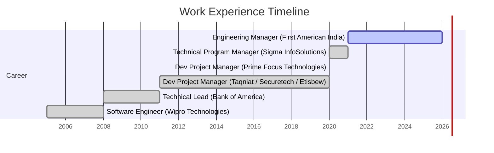

  
  

  

<h3 align="center">🚀 Building the Clouds, One Block at a Time ☁️</h3>

  I am an <strong>Engineering Manager</strong> with a deep passion for <strong>Platform Engineering</strong>, <strong>SRE</strong>, and <strong>Cloud Native</strong> technologies. I love automating the boring stuff and building robust, scalable infrastructure.

---

### 💼 Work Experience

---

### 🛠️ Tech Stack & Tools

  
  
  
  
  
  
  
  
  
  
  
  
  

---

### 📊 GitHub Stats

  

---

### 🤝 Connect with Me

  
  

